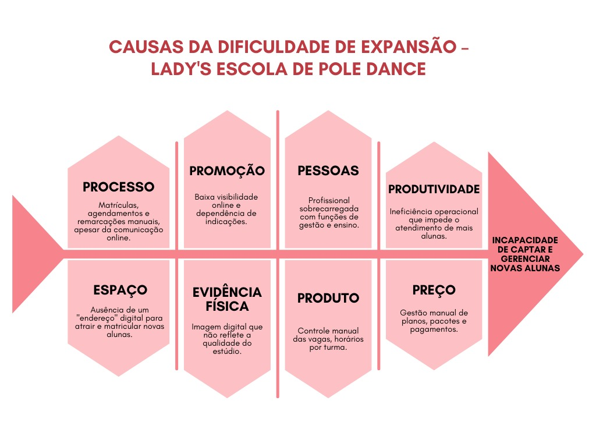

# Cenário Atual

## Introdução ao Negócio e Contexto

A Lady's Escola de Pole Dance é um estúdio especializado em aulas de Pole Dance, fundado e gerido por uma única professora que também atua como personal trainer. A empresa tem como público-alvo principalmente mulheres jovens e adultas interessadas em melhorar a saúde física, a autoconfiança e o bem-estar por meio do Pole Dance.

Mesmo que esteja no grupo de esportes minoritários no quesito acesso e conhecimento ao público comum, a Lady's Escola de Pole Dance se destaca pela abordagem personalizada, pelo acompanhamento próximo da professora e pela criação de um ambiente acolhedor para as alunas. 

Atualmente, o estúdio funciona de forma presencial, com turmas separadas por níveis, mas ainda não possui um sistema digital para controle de capacidade das turmas, matrícula online, ou que sirva como um meio informativo sobre a prática do Pole Dance e trabalho da professora (cliente) em questão.

O projeto surge como uma oportunidade para modernizar e apoiar a gestão do negócio, oferecendo um ambiente online que facilite a divulgação do trabalho da cliente, sirva como um meio de controle de capacidade das turmas e fortaleça a proposta de valor da Lady's Escola de Pole Dance no setor de atividades físicas e bem-estar.

## Identificação da Oportunidade ou Problema

*Figura 1 – Diagrama de Ishikawa das causas da dificuldade de expansão da Lady's Escola de Pole Dance.  
Fonte: O autor (2025).*

A cliente encontra dificuldade em atrair alunas próximas que conheçam a modalidade além do estereótipo comum associado ao Pole Dance. 

Como o estúdio é administrado somente por ela, todo o controle de contatos, agenda, remarcação de aulas e atualização de pacotes e planos, que passam por reajustes periódicos, depende exclusivamente de seu tempo. 

Assim, percebe-se a oportunidade de otimizar o processo organizacional, aumentando a produtividade e facilitando a adaptação ao meio online, visto que parte de seu marketing e gestão como contato com as alunas matriculadas, além de clientes em potencial, já é feito por plataformas avulsas como: WhatsApp, Instagram e Facebook, que, apesar de auxiliarem, ainda se mostraram insuficientes.

## Desafios do Projeto

Na Lady's Escola de Pole Dance, a mudança de uma gestão mais artesanal para uma operação digital profissional envolve desafios que vão muito além da escolha de um software.

Os principais desafios são:

- **Organizacional e humano:** Hoje, quase toda a rotina depende diretamente da proprietária, o que já gera sobrecarga. A implantação de um sistema novo exigirá dela tempo para aprender, configurar e adaptar processos, aumentando esse peso no curto prazo. O sucesso do projeto depende diretamente da usabilidade do produto e da capacidade da gestora de absorver essa nova demanda em meio às suas funções atuais.

- **Continuidade operacional e experiência do cliente:** As alunas estão habituadas ao contato via WhatsApp, e a transição para um sistema automatizado deve ser conduzida com cuidado para evitar atritos ou a percepção de um serviço impessoal. É essencial implementar a plataforma sem perder dados e, simultaneamente, comunicar os benefícios da mudança para garantir a adesão das clientes.

- **Integridade dos dados:** Atualmente, as informações estão espalhadas entre planilhas, conversas no WhatsApp e contatos pessoais. Consolidar e migrar essa base de dados informal para um sistema estruturado apresenta um risco considerável de erros na transcrição de planos, o que poderia gerar cobranças incorretas.

- **Estratégico:** A nova plataforma será a vitrine digital da escola. Mais do que cumprir sua função prática, precisa transmitir uma imagem profissional e acolhedora, ajudando a quebrar estereótipos e a atrair o público certo.

Em conjunto, esses desafios mostram que o projeto não é uma mera implementação de software, mas uma transformação fundamental no modelo de negócio. Ele envolve processos, a capacitação da gestora, a usabilidade do software e a construção de uma base sólida para o crescimento escalável do negócio.

## Segmentação de Clientes
