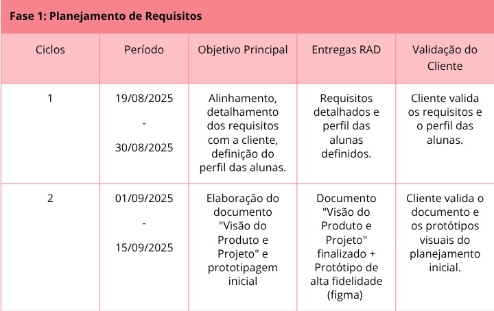
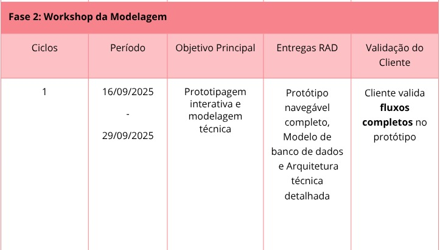
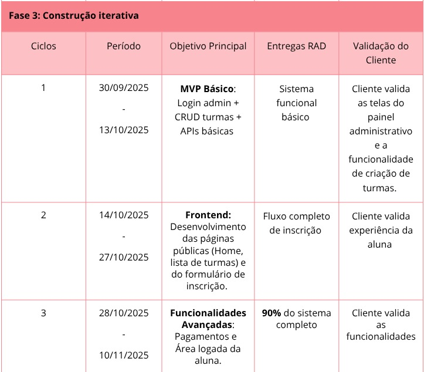
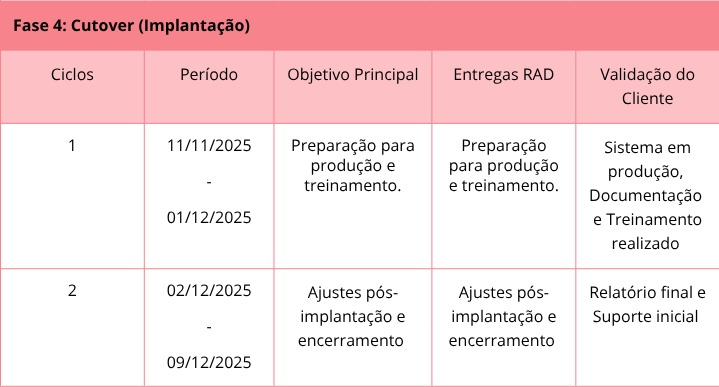

# Cronograma e Entregas (RAD)

A partir da estratégia de desenvolvimento de software estabelecida, apresenta-se a seguinte proposta de cronograma, com suas fases conforme o processo **RAD (Rapid Application Development)** e os resultados esperados. As fases foram organizadas em ciclos semanais, categorizados de forma a atender ao faseamento do RAD.

# Detalhamento das Fases e Foco das Entregas

## Fase 1: Planejamento de Requisitos
Nesta fase inicial, são levantados e detalhados os requisitos do sistema, incluindo o perfil das usuárias e as necessidades específicas da cliente. Também ocorreu a definição do documento de visão, protótipos iniciais e planejamento de tecnologias a serem empregadas.

---

## Fase 2: Workshop da Modelagem
Esta fase constitui o núcleo do processo RAD. Ocorre intensa colaboração entre cliente e equipe de desenvolvimento, com a criação de protótipos interativos, validações frequentes e ajustes rápidos. O objetivo é assegurar que o sistema atenda às expectativas antes da construção definitiva.

---

## Fase 3: Construção Iterativa
Com base nos protótipos validados, esta fase envolve o desenvolvimento completo do sistema. Inclui a implementação de funcionalidades críticas (como pagamentos), testes aprofundados e refinamento do produto até estar pronto para implantação.

---

## Fase 4: Cutover (Implantação)
Esta é a fase de transição, em que o sistema passa do ambiente de desenvolvimento para o uso real. Inclui a apresentação final ao cliente, treinamento, ajustes finais e a entrega oficial do projeto.

