**ATA DA REUNIÃO COM O PROTÓTIPO DA CLIENTE \- SITE**  
**26/09/2025 \- (07:10 \- 07:48) \- (presencial)**

VERSÃO NOVA:  
**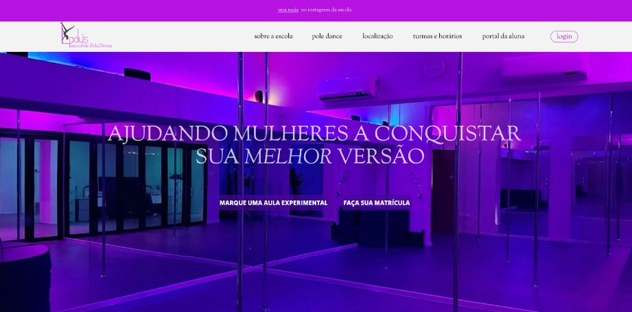**

Comentários da cliente:  
“Eu gostei mais desse formato, com as cores da escola” \- as cores da escola de Pole Dance são principalmente: roxo e preto.   
“Eu não vi que tinha algo escrito na parte roxa” \- quando mostrei que tinha algo acima do header, um direcionamento para o instagram, ela disse que estava muito pequena a fonte e pediu para revisar o modelo antigo.

VERSÃO ANTIGA:  
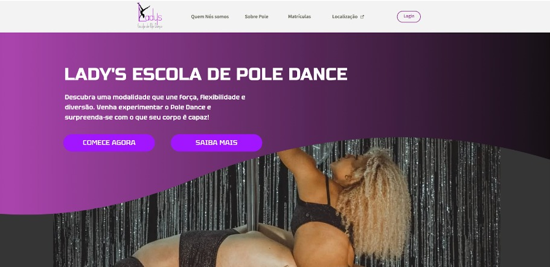
Comentários da cliente:  
“Prefiro o outro (versão nova) por conta das cores, mas nesse consigo ler melhor as letras   
pequenas, gosto mais dessa fonte”

**CONCLUSÃO DA PRIMEIRA PÁGINA:**

1. **Podemos manter o modelo novo alterando as fontes/tamanho do header e acima do header para facilitar a leitura e ser mais amigável, ela disse que gostaria de um direcionamento mais claro para o instagram se for isso que estamos criando, pois o link acima da página é algo que ela não reparou. Outro ponto é que podemos usar “melhor o logo” e que ele tá “muito pequeno”.**

VERSÃO NOVA:  
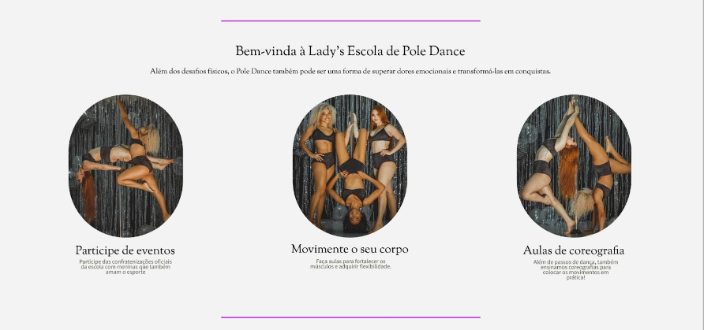

Perguntei aqui o que ela tinha achado desse modelo de página, visto que é também bem diferente da primeira versão e mais clean.  
Cliente: “Eu gostei das imagens”.   
Ela começou a analisar e perguntar, mas deixei claro que dava para alterar em tempo real o modelo, ela deixou comentários como:  
“A fonte é muito pequena, eu não consigo ler direito o que está escrito.”   
Alteramos tanto o tamanho quanto a fonte, mas ela disse que o problema não era só a fonte, olhamos a versão antiga para comparar.  
Comentários da Cliente (após fazer uma breve comparação com o antigo molde):  
“Tá muito pequena a fonte, não consigo ler”  
“Tá parecendo meu trabalho de TCC, como se fossem slides”

VERSÃO ANTIGA:  
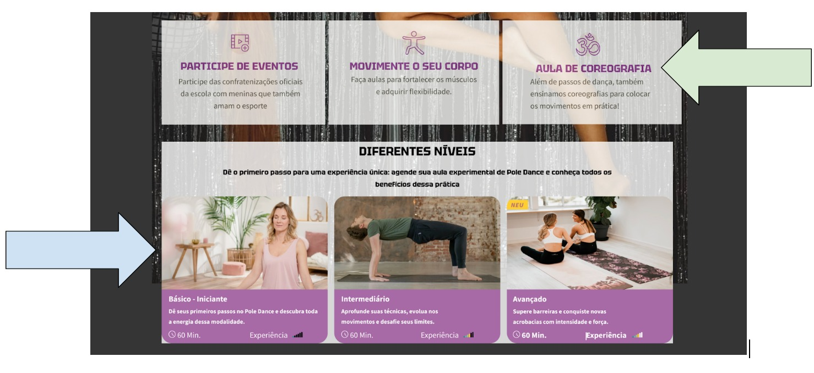

Comentários da cliente:  
“Aqui eu consigo ler claramente (“participe de eventos”, “movimente o seu corpo”, “aula de coreografia”) com informação, lá (no modelo novo) não consigo.”   
“Não tem como pegar isso aqui (seta azul) e colocar as imagens do modelo antigo nesse formato?”

**CONCLUSÃO DA SEGUNDA PÁGINA:**

1. **A cliente gostou dos blocos definidos na versão antiga e quer colocar eles no modelo da versão nova, se possível usar o mesmo formato ou parecido (como apontado) pela seta azul para colocar as imagens e algo “blocado” (como apontado pela seta verde) se for inserir informações.**  
2. **Ela não tem preferência de fonte, mas ela disse que quer algo menos vazio para a segunda página, apesar de não ter gostado tanto do formato da segunda versão, o fato das informações serem divididas em blocos fez ela preferir esse modelo.**

**CONCLUSÕES GERAIS:**

1. **Analisando o figma da nova versão com o que já está estruturado: podemos manter o molde clean com o fundo branco, mas vamos ter que “preencher” mais o site com chamadas visuais: informações/textos em blocos, ela deu uma ênfase muito grande nas informações serem em blocos, disse que chama a atenção, invés de sem eles.**  
2. **Ela disse que não achou claro se na nova versão, se os subtítulos da segunda página são botões, se forem, ela quer que pareçam botões \-\> nessa parte eu também fiquei confusa, já que na versão antiga, não eram botões, então o hoover é decorativo? \-\> Quando passamos o mouse em cima fica roxo, o que é um efeito legal, mas não entendi (pessoalmente acho que por não está em reunião), se era para ser só um efeito visual ou se é uma espécie de botão**  
3. **Minha análise pessoal e comentários sobre: A primeira versão/versão antiga é menos clean e mais grosseira, pois como inspiração foram usados sites de academia invés de sites de estúdio. A ideia era associar à escola como esporte também e algo menos apelativo ou muito feminino, a segunda versão também alcançou estes resultados, porém ela está muito clean, apesar de visualmente ser mais agradável, até pelo fato do fundo ser mais claro, parte do nosso público apresenta uma faixa etária mais avançada, as fontes precisam ser maiores ou com certa profundidade para chamar atenção. Acredito que, por enquanto, podemos tentar adicionar as informações em blocos e tentar criar um contraste entre o hoover e as informações do hoover como: aumentar a profundidade da letra, mudar o tom de fundo, tamanho ou se for necessário a fonte, para chamar atenção.**  
4. **Não é bem um pedido, está mais para uma reclamação, ela quer o símbolo (logo da escola) mais aparente, eu pensei em puxar a imagem e tentar colocar ela no final da página, já que o “L” pode ser alongado, se essa visão não fizer sentido ou não for possível, podemos pensar em outras soluções que chamem mais atenção ao símbolo da escola.**  
5. **A versão nova ganhou, se não ficou claro pelas observações, mas ela quer incorporar partes semelhantes ou parecidas da versão antiga dentro da nova versão.**

**ATA DA REUNIÃO COM O PROTÓTIPO DA CLIENTE \- SITE**  
**05/10/2025  \- (presencial) \- NOVA LANDING PAGE DE ACORDO COM O FEEDBACK ESTABELECIDO E IMAGENS DISPONIBILIZADAS PELA CLIENTE:**  
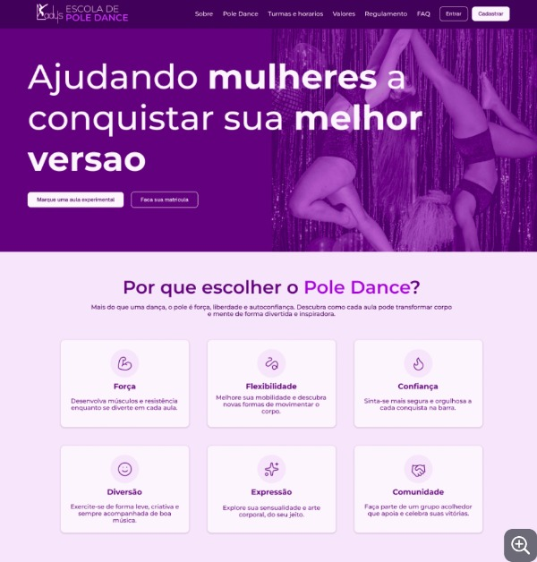

**ATA DA REUNIÃO COM O PROTÓTIPO DA CLIENTE \- SITE**  
**05/10/2025  \- (presencial)**

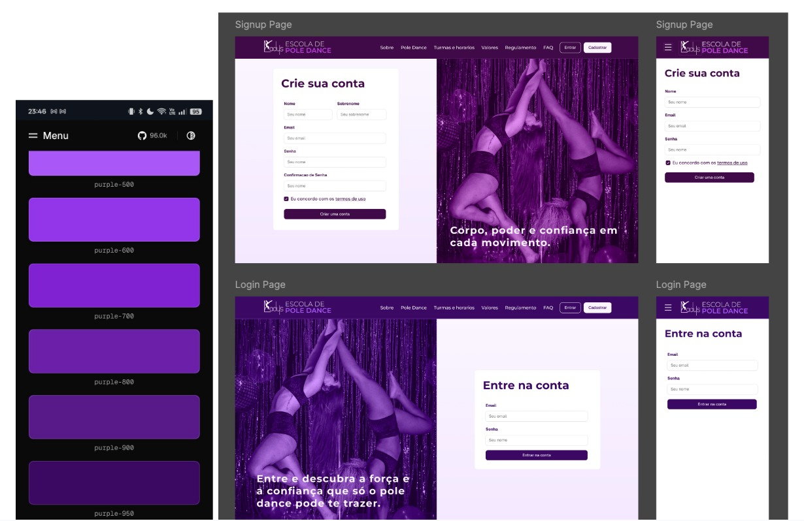

Comentários da cliente:  
Ela gostou que as mudanças em cores fosse para representar as funcionalidades diferentes da tela, também gostou das frases de efeito que se localizam na parte inferior das imagens, uma parte importante que ela gostou foi o fato do símbolo da escola ficar centralizado e aparecer em todas as telas de forma “chamativa”.   
A cliente especialmente gostou da mescla entre diferentes tons, então foi requisitado que a landing-page também sofresse alterações

**ATA DA REUNIÃO COM RELAÇÃO AOS REQUISITOS E NOVA LANDING PAGE \- SISTEMA DE PACOTES**

**08/10/2025  \- (online)**

Comentários da cliente sobre a função de gerenciamento de pacotes:  
Durante a reunião discutimos como o site deve liberar os pacotes de aula, e a conclusão obtida entre a equipe e a cliente, foi que certos pacotes devem ser liberados somente para certas alunas após ela obtiverem algum nível, a ideia era que as alunas seriam divididas em níveis como: básico, intermediáriointermdiário e avançado, assim os pacotes de aula para alunas do básico seriam disponibilizados somente para alunas do básico e em diante. Caso alguma aluna atingisse um nível maior (atestado pela professora após certo período de aulas e evolução), o site automaticamente iria disponibilizar novos pacotes para novos nivéis. A tela de pacotes ainda não estava desenvolvida, mas a ideia e os requisitos estavam anotados e transmitidos na documentação.

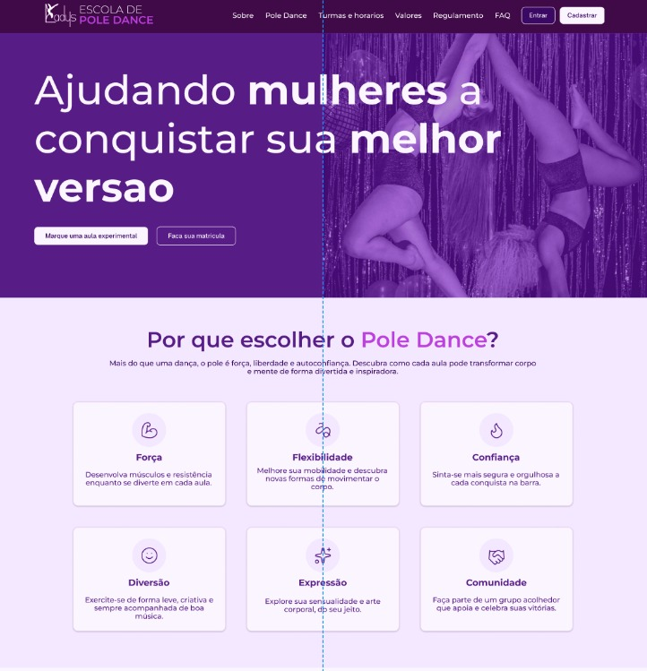

A cliente aprovou a nova landing-page durante a reunião online, sem comentários.

**ATA DA REUNIÃO COM RELAÇÃO AOS DADOS OFICIAIS E ESTILO DE PÁGINA DO LANDING PAGE**   
**15/10/2025**  
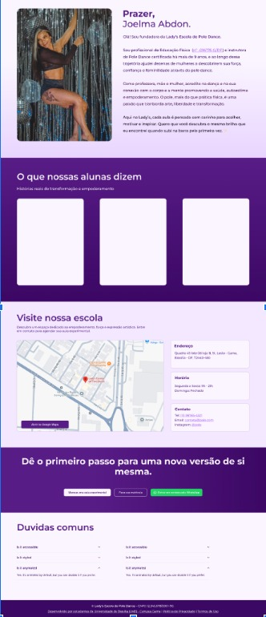
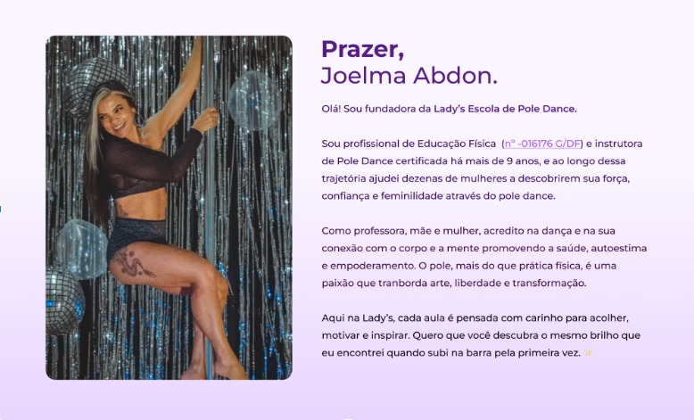
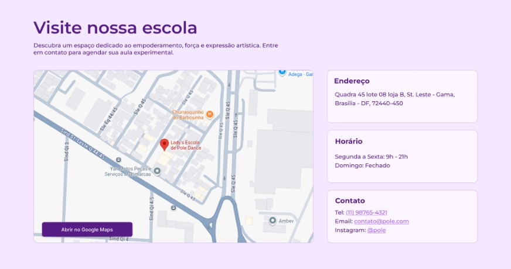
Durante a reunião a cliente validou os dados colocados e compartilhou com a equipe seu registro oficial e outras informações disponibilizadas online encontradas pela equipe, também aprovou a foto (ela mesma que escolheu durante a reunião e comentou sobre posicionamento e corte), também fez modificações após leitura do corpo (em sua apresentação e no chamado em “Visite nossa escola”), o estilo dos cards e as cores foram aprovadas,, ao final da reunião a página foi aprovada para implementação.

**ATA DA REUNIÃO COM RELAÇÃO AOS REQUISITOS \- SISTEMA DE PACOTES**  
**05**  
**29/10/2025 \- 30/10/2025  \- (presencial)**

Durante a reunião a parte de front-end discutiu-se com a cliente o sistema de pacotes e acessos para o desenvolvimento agora que a parte do sistema tinha sido implementada, como seria desejado pela cliente que a aluna visualizasse o pacote de aulas, foi descoberto durante a reunião que os nivéis de básico, intermdiário e avançado fazem parte da modalidade, mas não são as categorias que dividem os pacotes oficialmente na escola, a cliente dividi e cria os pacotes de acordo com a frequência, o nível da aluna é uma convenção útil para criar o cronograma da aula, mas essa é uma questão interna que não afeta o produto e não faz parte do escopo. Seguiu-se o seguinte comentário da cliente “1. Uma aula na semana \- em grupo, 2\. Duas aulas na semana \- em grupo, 3\. Três aulas na semana \- em grupo, 4\. Aula particular 1 vez na semana, 5\. Aula particular duas vezes na semana, 6\. Aula de flexibilidade duas vezes na semana.”  
Levou-se em consideração se deveríamos, então, no painel de administrador colocar uma gestão de monitoramento das aulas para que a cliente anotasse digitalmente os movimentos realizados por cada aluna para registrar a quantidade e com o tempo poder aferir evolução de nível, porém, devido à natureza do projeto e a quantidade exorbitante de movimentos não-oficiais que surgem na modalidade, somando-se a preferência do cliente em continuar com um sistema manual em sua planilha, decidimos continuar apenas focando na criação de um CRUD de pacotes e como eles seriam disponibilizados no sistema.

No dia seguinte foi liberado o modelo de pacotes que seriam gerenciados pela cliente seguindo as devidas orientações e modificando o requisito:

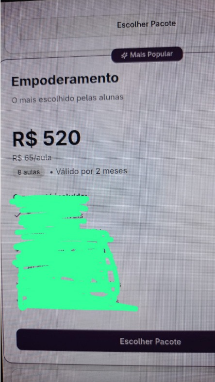
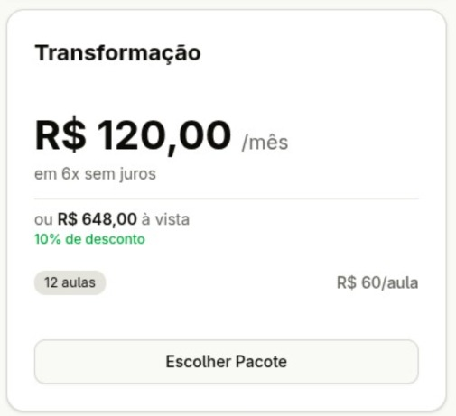
A cliente gostou do modelo de design do pacote e reiterou se ela poderia modificar as questões de preço e assinatura de planos, como especificado anteriormente, ela realiza contratos com vencimento mensal e é incomum a compra de 6 meses ou mais à vista.

Após feedback, no mesmo dia foi realizada a seguinte entrega:  
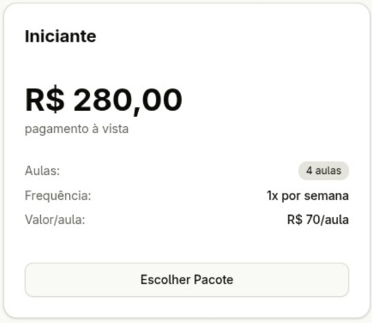
A cliente ficou satisfeita e disse que gostaria que o título fosse “Pole Dance 1x”, depois que foi especificado que ela vai poder editar o nome, preço e outras funcionalidades do card, inclusive colocar aulas diferentes como “aula de flex” ela aprovou as mudanças que terminaram de ser implementadas.

**ATA DA REUNIÃO EM RELAÇÃO A API E BANCO**  
**05/11/2025  \- (online)**

A equipe repassou com a cliente a possibilidade de utilizar o mercado pago e qual seria o banco da maquininha utilizada para realizar os pagamentos na escola, após alguns apontamentos, foi decidido que utilizaremos o SumUP, o banco utilizado pela cliente na escola e também o banco afiliado à sua maquininha para que não houvesse mudanças bruscas na implementação do site e o sistema fosse uma continuidade do trabalho que já ocorre presencialmente como desejado, a equipe parou a implementação e pesquisa no mercado Pago e passou a seguir com SumUP.

**ATA DA REUNIÃO AS PÁGINAS DE FAQ E REGULAMENTOS DA ESCOLA.**  
**14/11/2025  \- (presencial)**

Foram repassadas as páginas de exemplo e conteúdo para FAQ e Regulamentos, a cliente aprovou o FAQ, mas desaprova a página de regulamentos, disse que a página tem informações úteis que deveriam ser passadas para o FAQ, mas que o site não deveria ter nenhum regulamento acerca da Escola e que essas questões, se fosse do interesse do visitante ou da aluna, poderiam ser repassadas por ela após a pessoa entrar em contato com ela diretamente com as informações do site. Então a página de regulamentos:

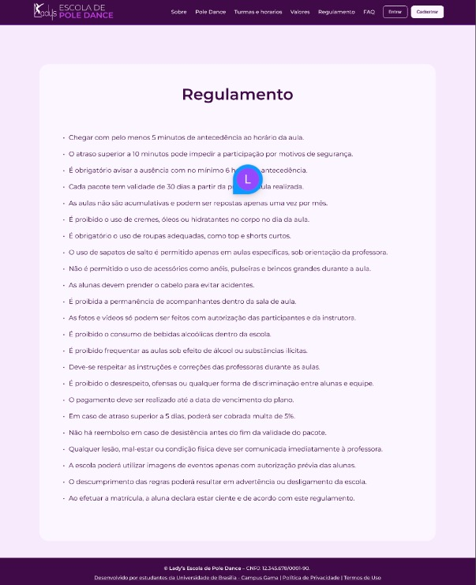
foi cortada do escopo, porém seu conteúdo se manteve no design para ser implementado na página de FAQ:  
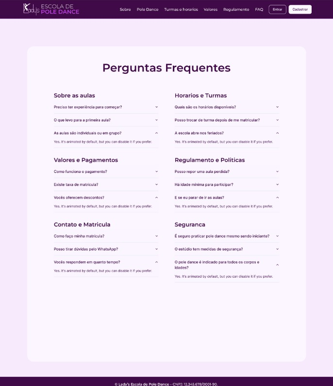

**ATA DA REUNIÃO AS PÁGINAS DE FAQ E REGULAMENTOS DA ESCOLA.**  
**10/11/2025  \- (presencial)**

Conversados sobre o conteúdo e material disponibilizados no site, a página sobre informações acerca do pole dance (a página informativa) pedida pela cliente. A cliente disse que desde que o conteúdo obtido fosse de fontes confiáveis (seu próprio artigo) e as referências utilizadas por ele, poderíamos o referenciar sem medo afins de preencher a página.

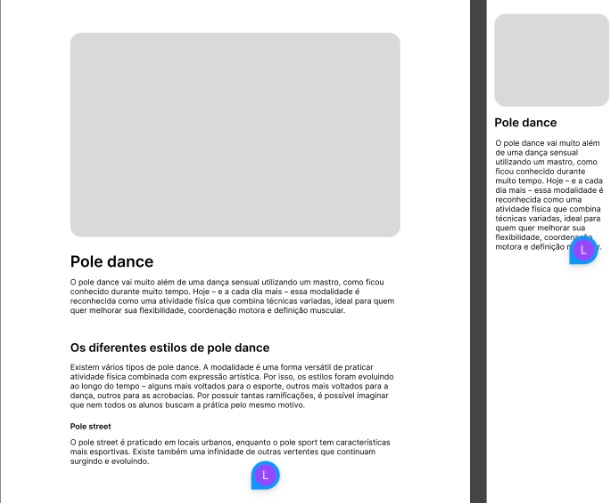
